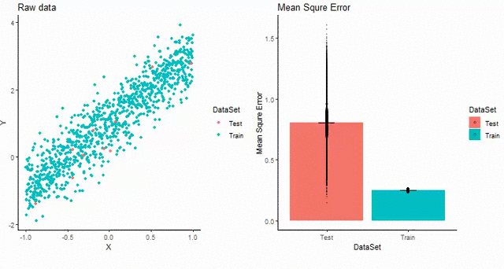

TITLE : K-fold Cross Validation

Author: Wayne Ng

Affiliation: Graduate Certificate Candidate, Harvard Extension School 

#

K-fold Cross Validation

Code:https://github.com/wayneng2010/CrossValidation/blob/master/WayneNg_code.R

Explanation: 
This visualization demonstrates how K-fold Cross Validation(K-fold CV) works. It is important because we want to determine the accuracy of our prediction model in a prediction problem. K-fold Cross Validation is a good re-sampling method and can measure model prediction performance in practice. In this submission, I created a linear random samples and applied linear model prediction. To perform K-fold CV, I divide the set of observations into k groups, or folds, of equal size. The first fold is treated as a validation set(test set), and the linear method is fit on the remaining k - 1 folds set(train set). The mean squared error(MSE) is computed on both train and test set separately. To simulate, I have selected K-fold as 3,5,10,20,100-fold. The choice of K-fold is to demonstrate that MSE of K-fold CV can go up when we have larger K-fold. In this case, when we have 100-fold, the set of observations are divided into 100 sets. Use 1/100 set of observations for testing. Use 99/100 set of observations for training. From simulation, 100-fold CV has the worst MSE with smallest sampling size. The best K-fold CV is 10-fold in this simulation. 

In the example, on the left panel, you can see the raw data are divided into test and train set. Initially, when you see larger population of test set, we have a low K-fold such as 3,5,10. The low K-fold CV resulted in lower MSE with larger simpling size that is shown on the right panel. When K-fold increase, test and train set becomes smaller in sample size. That result in larger MSE on test set. From this example, we can observe how samples size influence MSE in K-fold CV. In practice, we usually use 10-fold CV. 
